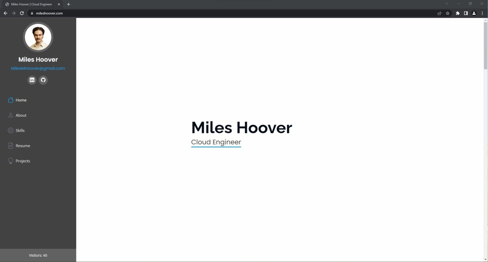

## Update

**03/04/24**: This project is officially archived and I no longer host mileshoover.com declaratively through Terraform via AWS. I have decided to host my website on Netlify for the simplicity and cost savings. I have also decided to remove the page view count feature from my website as it was not providing any real value to my readers and was simply a learning experience.

---

## Completing The Cloud Resume Challenge

The [Cloud Resume Challenge](https://cloudresumechallenge.dev/), created by the talented [Forrest Brazeal](https://www.linkedin.com/in/forrestbrazeal/?lipi=urn%3Ali%3Apage%3Ad_flagship3_publishing_post_edit%3BuwbroVATRBypN2JvUa2DDw%3D%3D), is a project to build a personal resume website and page view count function from scratch using several cloud services. On top of this, you are tasked with implementing several common practices in DevOps such as provisioning infrastructure as code (IaC), Creating a continuous integration & continuous deployment (CI/CD) pipeline to automate your workflow, and designing thorough unit tests to make sure your code works flawlessly.

I have always been interested in building web services but have never utilized any “serverless” infrastructure or DevOps principles in my previous projects. When I learned about The Cloud Resume Challenge my curiosity instantly peaked and I thought this could be the perfect opportunity to get my hands dirty in the cloud. I had no idea how far the rabbit hole went that I was about to jump into but I’m incredibly glad I did. Through completing this project, I have learned several fascinating new technologies and ideas that I will be able to utilize and build upon moving forward on my path as a developer.

Diagram:

### The Frontend

For the frontend, I started by creating a GIT repository to maintain clean source control and utilize my code anywhere I needed to. From there, I set up Terraform to handle Amazon Web Services (AWS) which would provide the infrastructure my website would be built on. Next, I set up an AWS account with the minimum required privileges to make changes to the AWS services I would be using, and finally, I was ready to start building my website.

I provisioned an AWS S3 resource to contain all of my HTML, CSS, and Javascript files that would serve as the basis of my static website. AWS Cloudfront was then employed to secure my website with HTTPS and provide ultra-fast distribution through their wide array of Edge datacenters. I then pointed my newly purchased AWS Route53 domain name, “mileshoover.com”, to the Cloudfront distribution so that whenever users hit my domain, they will be served content quickly and securely.

### The Backend

Moving on to the backend, I began to set up the infrastructure to build my page view count web service. First, I provisioned an AWS DynamoDB table to store the current view count for my website. Next, I built a REST API with AWS API Gateway to bridge the gap between my web application and my database. Designing and implementing a REST API was an incredibly interesting experience and by far my favorite part of this project. Once my API was complete, I used AWS Lambda to create the Python function to UPDATE the current view count by +1 upon request and then GET the new total view count for display on my site. To do this, I used Boto3, an AWS SDK that made integrating Python code and AWS a breeze.

After my database, API, and increment program were complete I utilized Cypress to test my application. Cypress is a tool used for end-to-end API testing to catch any problems before they have a chance to disrupt my application when it’s in production. I created Cypress tests to check requests if they were a 200 response instead of a 4xx or 5xx response. Also, I set up Cypress to make sure the body of my response was a number, or not null, to make sure the correct data is getting passed through.

To complete this project, I created a CI/CD pipeline to automate the testing and deployment of my website. I specified that upon push request, my Cypress tests would be trigged and if passing successfully, Terraform would initialize and deploy any infrastructure changes. Creating a CI/CD pipeline made the workflow of deploying and testing my website much easier and freed up time that would have been spent doing these tasks by hand.

### Conclusion

Through completing The Cloud Resume Challenge, I have learned a great deal about the process of provisioning cloud infrastructure and the bigger picture behind DevOps concepts such as IaC, CI/CD, and testing. I also got to explore REST APIs and sharpen my Python skills by developing the backend portion of my website. Although I’ve learned a lot, I have hardly broken the surface in the vast world of DevOps and cloud-based infrastructure. Moving forward, I will continue exploring the concepts and tools introduced to me and I’m incredibly eager to see how far I can take them.

Thanks again to [@forrestbrazeal](https://www.linkedin.com/in/forrestbrazeal/?lipi=urn%3Ali%3Apage%3Ad_flagship3_publishing_post_edit%3BuwbroVATRBypN2JvUa2DDw%3D%3D) for creating this challenge and also [@LouJayBee](https://www.linkedin.com/in/loujaybee/?lipi=urn%3Ali%3Apage%3Ad_flagship3_publishing_post_edit%3BuwbroVATRBypN2JvUa2DDw%3D%3D) who was a great help to me throughout this entire process, without them none of this would have been possible.

### Links

[Frontend GitHub](https://github.com/MilesHoover/CRC-Frontend)

[Backend GitHub](https://github.com/MilesHoover/CRC-Backend)
